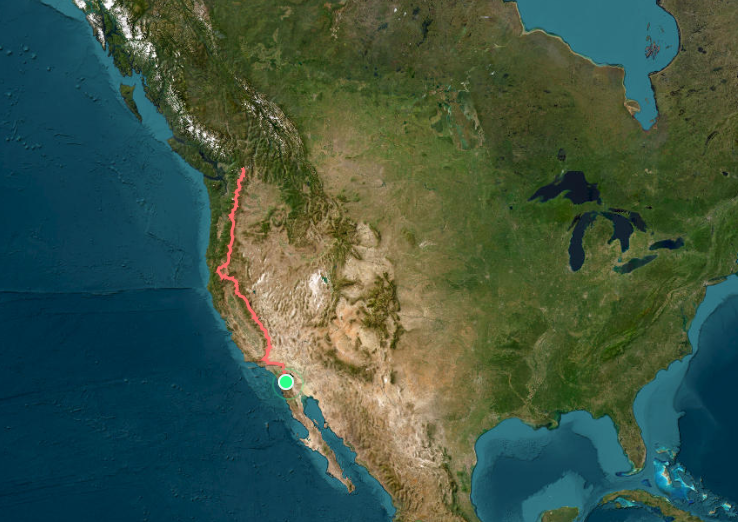
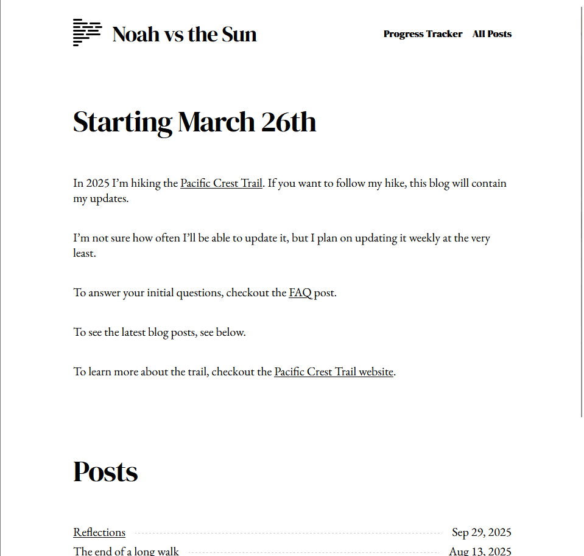
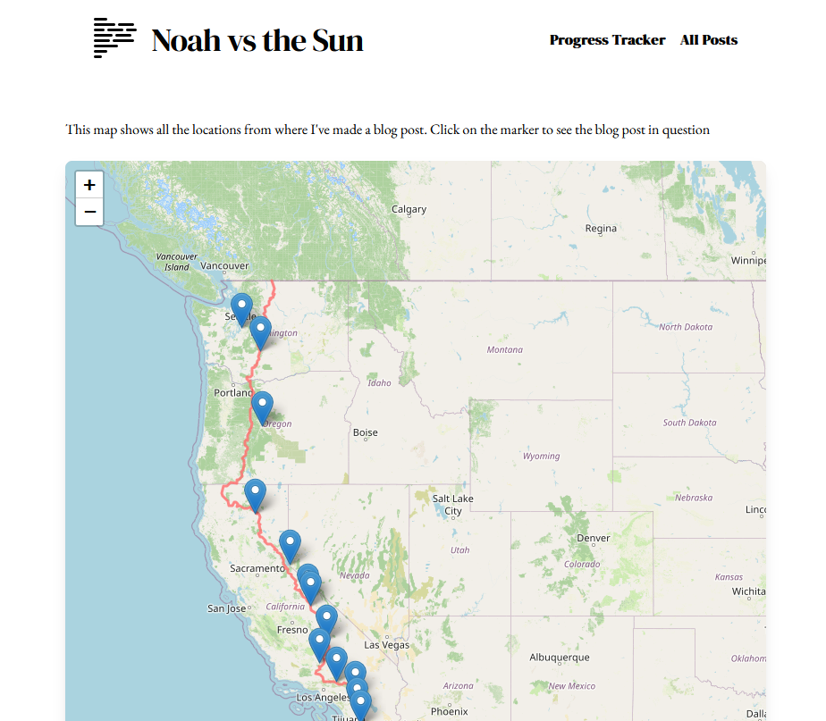
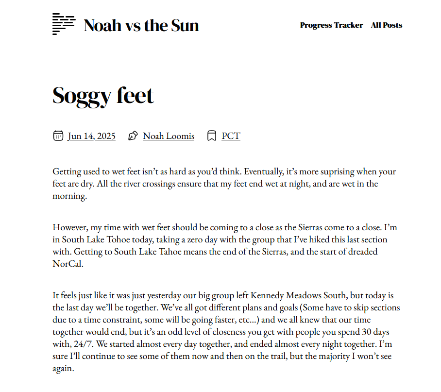
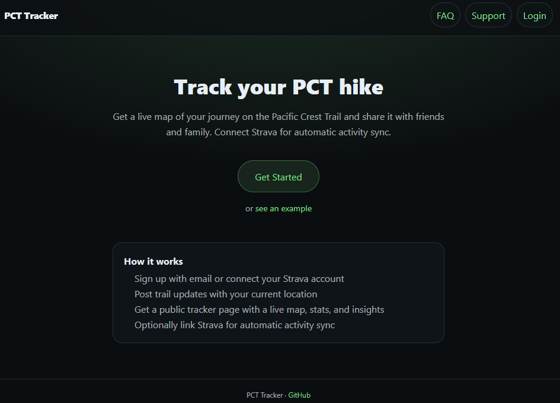

---
# try also 'default' to start simple
theme: default 
# random image from a curated Unsplash collection by Anthony
# like them? see https://unsplash.com/collections/94734566/slidev
title: Pacific Crest Trail
# https://sli.dev/features/drawing
transition: slide-left
class: text-center
# enable Comark Syntax: https://comark.dev/syntax/markdown
comark: true
---

# Pacific Crest Trail

A better way to track it

<!--
The last comment block of each slide will be treated as slide notes. It will be visible and editable in Presenter Mode along with the slide. [Read more in the docs](https://sli.dev/guide/syntax.html#notes)
-->

---
transition: fade-out
background: ./images/map.png
---

# The Pacific Crest Trail: 4560km hike from Mexico to Canada

<v-click>

- Through California, Oregon, and Washington
- 10,000 annual attempts
- 25% success rate

</v-click>

<!--
You can have `style` tag in markdown to override the style for the current page.
Learn more: https://sli.dev/features/slide-scope-style
-->

<!-- I left in March, finished in August, took 139 days. This time last year, I was climbing Mt Whitney-->
---
layout: image-right
image: ./images/sierras.jpg
backgroundSize: 20em 
---

# This time last year

---
---

# noah-vs-the-sun.com

  
  
  

---
---

# Problems with the blog

**Pros**

<v-clicks>

- Minimalist
- Featured a map with a progress tracker
- Images were an accompaniment, not the main attraction to each post

</v-clicks>

**Cons**

<v-clicks>

- In order to update the map with my location, I had to manually make a blog post.
- Markdown seemed like a great easy way to make updates — until you have to do it on your phone

</v-clicks>

---
---

# How can I improve it?
<v-clicks>

- Anybody should be able to use something like my custom blog
- Making a blog post just to update the location is a bit tedious
- Friends and family being notified when a new post is made would save lots of time and energy 
</v-clicks>

---
---

# pct-tracker.com

<v-clicks>

- Sends emails to friends and family when you post
- Super easy to make updates from your phone
- Anyone can set it up for their own thru-hike - no coding knowledge required, just a sign up
- Optional Strava integration for automatic location updates

</v-clicks>

<v-clicks>
 
</v-clicks>

---
layout: center
---

# User: Friend and family

<video src="./images/family_demo.mp4" controls muted loop class="w-full rounded shadow-lg mt-4" />

---
layout: center
---

# User: PCT hiker
<video src="./images/hiker_demo.mp4" controls muted loop class="w-full rounded shadow-lg mt-4" />

---
layout: center
---

# Tech stack and challenges

**Tech stack**
- NextJS
- TailwindCSS for styling
- Supabase for storage
- Vercel for deployment
- Resend for email notifications

**Challenges**
- Strava integration and API limitations
- Building a user-friendly interface for non-technical users
- Getting the distance calculations done correctly based on the location provided (from strava or the user manually)

<!-- At first, was making too many strava api calls by getting all activitiesn from the start date forward -->

---
transition: slide-up
layout: image
image: ./images/start.jpg
---

# Before 

---
layout: image
image: ./images/end.jpg
---

# After

---
transition: slide-up
---

